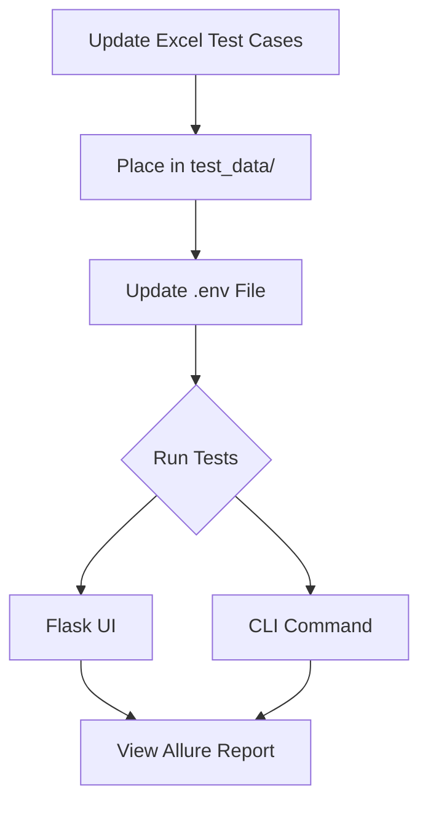

# Automation Testing Framework (Dockerized)

This project provides a Dockerized API testing framework with Excel-driven test cases, Allure reporting, and Flask-based execution.
[](https://opensource.org/licenses/MIT)

## 🚀 Quick Start

### **1. Running the Docker Setup**
To run the testing framework locally:

```bash
# Build the Docker image
docker build -t automation_app .

# Run the container (Linux/Windows)
docker run -p 5000:5000 --env-file .env automation_app

# For Mac (if port 5000 is occupied). also change the port number, see the Advanced Configuration for changing port number in flask app
docker run -p 5001:5001 --env-file .env automation_app
```
- Access the UI at:  
  🔗 [http://localhost:5000](http://localhost:5000) (or `5001` for Mac)  
  → Click **"Run REST API Tests"** to execute.

### **2. Updating Test Cases**
To modify tests:
1. **Edit** the Excel file: `test_data/test_data.xlsx`  
2. **Update `.env`** to match your filename:
   ```ini
   REST_TESTDATA_FILE=test_data.xlsx
   ```
3. Re-run the Docker container (changes take effect automatically).

---

## 📊 Test Execution Options

### **Method 1: Flask UI**
1. Start the container (as above).  
2. Open `http://localhost:5000`.  
3. Click **"Run REST API Tests"**.

### **Method 2: Command Line**
```bash
# Direct script execution (inside container)
python entrypoint_docker.py --testtype script_type
```

---

## 📂 Reports & Results
- **Allure Reports** are generated at:  
  `allure_data/api_allure_data/rest/allure-report.html`  
- **Access via UI**: Click the Allure Report link after test completion.

---

## ⚙️ Advanced Configuration

### **Port Customization (Mac)**
If port `5000` is occupied:  
1. Edit `flask_app.py`:
   ```python
   app.run(host='0.0.0.0', port=5001)  # Change port here
   ```
2. Run with `-p 5001:5001`.

### **Container Management**
```bash
# Stop a running container
docker stop <container_id>

# View logs
docker logs -f <container_id>
```

---

## 🔄 Workflow Summary


---
# **API Automation Framework Documentation**  

## **📁 Directory Structure**
```
.
├── api_fixtures/            # Core API request handling
│   ├── base.py              # Base API class
│   └── rest_api.py          # REST API implementation
│
├── logs/                    # Test execution logs
│   └── (generated at runtime)
│
├── templates/               # Flask UI templates
│   ├── index_prod.html      # Production test dashboard
│   └── index_staging.html   # Staging test dashboard
│
├── test_data/               # Test data and attachments
│   ├── attachments/         # Files for upload tests (PDFs, images, etc.)
│   └── test_data.xlsx       # Excel test cases
│
├── tests/                   # Test scripts
│   └── (pytest test files)
│
├── utilities/               # Helper utilities
│   ├── data_verification_utils.py  # Schema/response validation
│   └── api_test_status.py   # Test assertion handling
│
├── .env                     # Environment configs
├── entrypoint_docker.py     # Single-script test executor
├── flask_app.py             # Flask web interface
└── load_configs.py          # Environment config loader
```

---

## **🚀 Getting Started**
### **Prerequisites**
- Python 3.8+
- Docker (for containerized execution)
- Libraries: `pytest`, `requests`, `Flask`, `pandas`, `openpyxl`, `allure-pytest`

### **Setup**
1. **Clone the repository**  
   ```bash
   git clone <your-repo-url>
   cd <repo-folder>
   ```

2. **Install dependencies**  
  - You only need docker if you are running it with docker, everything else is installed automaticallly.
   ```bash
   pip install -r requirements.txt
   ```

3. **Configure environment**  
   - Update `.env` with your settings:
     ```ini
     REST_TESTDATA_FILE=test_data.xlsx
     BASE_URL=https://your-api-endpoint.com
     ```

4. **Place test attachments**  
   - Add files (PDF, word document and text for not) in `test_data/attachments/`  
   - Reference them in Excel (`attachment` column) by mentioning the file name.

---

## **🔧 Core Components**
### **1. `api_fixtures/`**
#### **`base.py`**
- **Base API class** with common methods:
  - Request/response logging
  - Error handling
  - Headers management

#### **`rest_api.py`**
- **Handles HTTP requests** (GET, POST, PUT, DELETE)
- **File upload support**:

## ** Excel-Driven Test Cases**  
**File Location:** `test_data/test_data.xlsx`  

This framework uses Excel to define test cases in a structured format. Each row represents a test step, and columns define the test parameters.

### **📝 Column Definitions**

| Column Name               | Description                                                                 | Example                          | Required? |
|---------------------------|-----------------------------------------------------------------------------|----------------------------------|-----------|
| **test_group**            | Groups related test steps (numeric ID). All steps in a group run sequentially. | `1`, `2`, `3`                   | ✅ Yes    |
| **test_number**           | Unique test step ID in format: `<test_group>_step_<step#>`                  | `test01_step_1`, `test02_step_2` | ✅ Yes    |
| **use_next**              | Specifies the next test step to execute (for chaining). Leave empty if no continuation. | `test01_step_2`                 | ❌ No     |
| **delay_before_test_sec** | Delay (in seconds) before test execution (useful for async operations).     | `1`, `5`                        | ❌ No     |
| **use_creds**             | API credentials (JSON format).                                              | `{"api_key": "test123"}`        | ❌ No     |
| **base_url**              | Overrides the base URL from `.env` if specified.                            | `https://api.example.com/v1`    | ❌ No     |
| **api_name**              | API endpoint name (must match framework's route mappings).                  | `create_user`, `get_order`      | ✅ Yes    |
| **request_type**          | HTTP method (GET, POST, PUT, DELETE, etc.).                                | `post`, `get`                   | ✅ Yes    |
| **test_group_name**       | Descriptive name for the test group (for reporting).                        | `User Creation Flow`            | ❌ No*    |
| **test_step_name**        | Descriptive name for the test step (for reporting).                         | `Step 1: Create User`           | ✅ Yes    |
| **payload**               | Request body (JSON format). Escape quotes with `""`.                        | `{"name": "John"}`              | ✅ Yes    |
| **attachment**            | Filename of attachment (must exist in `test_data/attachments/`).            | `user_contract.pdf`             | ❌ No     |
| **test_type**             | Test category (`positive`, `negative`, `edge_case`).                       | `positive`                      | ✅ Yes    |
| **response_schema**       | Expected JSON schema for validation.                                        | `{"type": "object", ...}`       | ❌ No     |
| **expected_outcome**      | Key-value pairs to validate in response (exact match).                     | `{"status": "success"}`         | ❌ No     |
| **un_expected_outcome**   | Key-value pairs that should NOT exist in response.                         | `{"error": "invalid"}`          | ❌ No     |
| **expected_response_header** | Expected headers (key-value pairs).                                     | `{"Content-Type": "application/json"}` | ❌ No |
| **skip_test**             | Set to `skip` to exclude the test from execution.                          | `skip`                          | ❌ No     |

> **Note**: The first test step in a group **must** include `test_group_name` for reporting.

---

### **📌 How to Add Test Cases**
#### **Example 1: Single-Step Test**
| test_group | test_number      | api_name    | request_type | payload              | test_type |
|------------|------------------|-------------|--------------|----------------------|-----------|
| `3`        | `test03_step_1`  | `create_user` | `post`      | `{"name": "John"}`   | `positive` |

#### **Example 2: Multi-Step Test (Chained)**
| test_group | test_number      | use_next       | api_name      | request_type | payload              |
|------------|------------------|----------------|---------------|--------------|----------------------|
| `1`        | `test01_step_1`  | `test01_step_2` | `create_user` | `post`       | `{"name": "John"}`   |
| `1`        | `test01_step_2`  | (empty)        | `get_user`    | `get`        | `{"user_id": "123"}` |

#### **Example 3: Skipped Test**
| test_number      | skip_test | test_step_name       |
|------------------|-----------|----------------------|
| `test03_step_1`  | `skip`    | `Skipped test demo`  |

---

### **🚨 Common Errors & Fixes**
| Error                        | Solution                                                                 |
|------------------------------|--------------------------------------------------------------------------|
| **"API not found"**          | Verify `api_name` matches framework definitions.                         |
| **"Invalid JSON"**           | Check `payload`/`expected_outcome` formatting. Use `""` for quotes.      |
| **"Test not running"**       | Ensure `skip_test` is not set to `skip`.                                |
| **"Attachment not found"**   | Confirm file exists in `test_data/attachments/`.                        |

---

### **⚙️ Advanced: Configs Sheet (Optional)**
The `configs` sheet can store reusable values (e.g., auth tokens, IDs). This part will be added in later releases.

---

### **📋 Best Practices**
1. **Group related steps**: Use `test_group` for sequential flows (e.g., create → update → delete).
2. **Descriptive names**: `test_step_name` should clearly explain the test purpose.
3. **Validate schemas**: Use `response_schema` for critical APIs.
4. **Negative tests**: Set `test_type` to `negative` and define `un_expected_outcome`.

---

### **3. `utilities/`**
#### **`data_verification_utils.py`**
- **Schema validation**:
  ```python
  def verify_schema(response, schema):
      """Validate JSON response against a schema"""
  ```
- **Response comparison**:
  ```python
  def is_subset(actual, expected):
      """Check if `expected` is a subset of `actual`"""
  ```

#### **`api_test_status.py`**
- **Soft assertions** (continue on failure):
  ```python
  def soft_assert_true(condition, message):
      if not condition:
          allure.attach(f"FAIL: {message}", name="Assertion")
  ```

---

## **🏃 Running Tests**
### **Option 1: Docker and Flask UI (Recommended)**
1. Start the Flask app, from inside the docker app:
  ```bash
  docker build -t automation_app .
  docker run -p 5000:5000 --env-file .env automation_app
  ```

2. Open `http://localhost:5000`  
3. Click **"Run REST API Tests"**.

### **Option 2: Command Line, inside the automation_app**
```bash
# Run all tests
pytest tests/...

```

---

## **📊 Reports**
- **Allure Reports** generated in:  
  `allure_data/api_allure_data/rest/`
- **Access via Flask UI** or directly open:  
  `allure-report.html`


---

## **Logs**
- **Logs** generated in:  
  `automation_app/logs`
- **Access via Flask UI using /logs in the url** 🔗 [http://localhost:5000/logs](http://localhost:5000/logs):  

---

## **🛠️ Troubleshooting**
| Issue                          | Solution                          |
|--------------------------------|-----------------------------------|
| Excel file not found           | Check `.env` `REST_TESTDATA_FILE` |
| Attachments fail to upload     | Verify file exists in `test_data/attachments/` |
| Allure report not generating   | Run `allure serve allure_data/`   |

---

## **📜 License**
MIT License - Free for modification and redistribution.